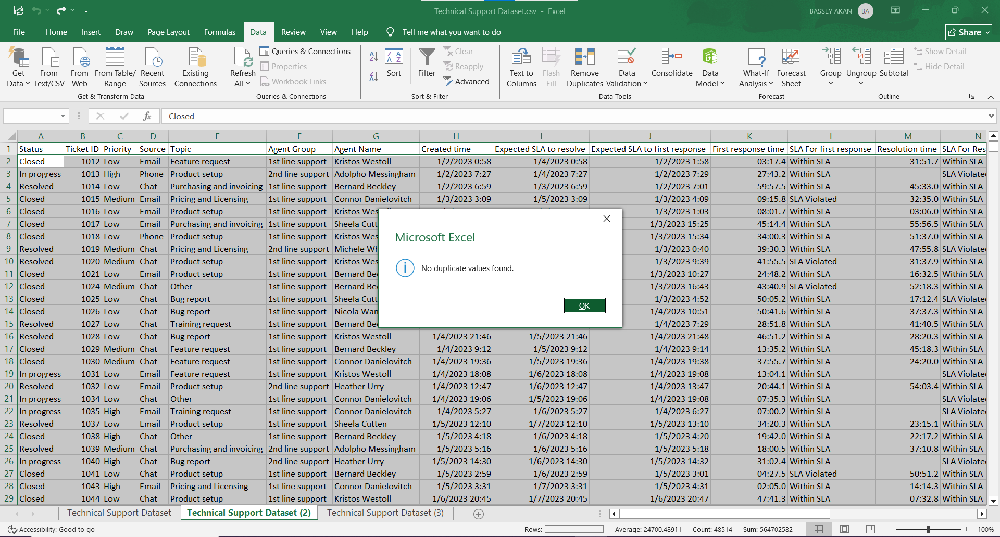
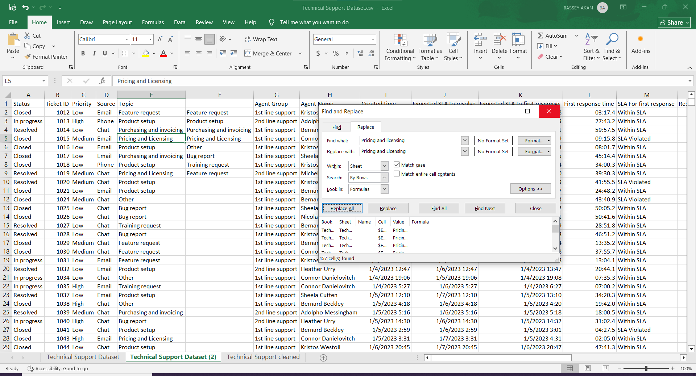
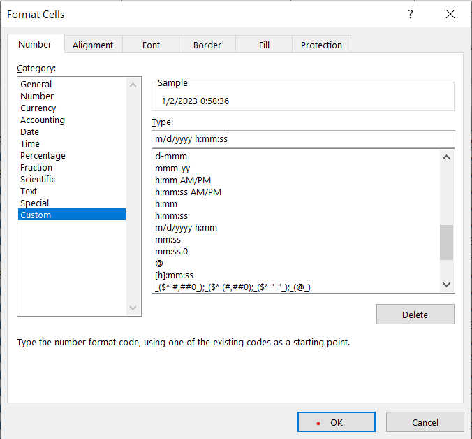
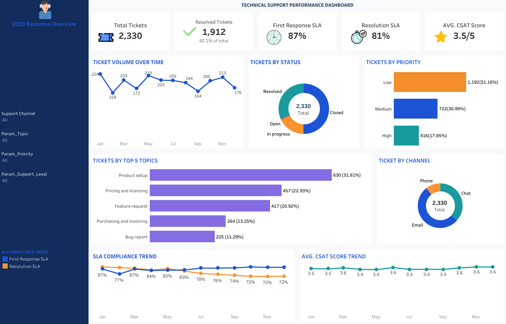

# Technical-Support-Performance-Analysis
# Technical Support Performance Analysis


---

## Table of Contents

- [Executive Summary](#executive-summary)
- [Business Objectives](#business-objectives)
- [Business Questions](#business-questions)
- [Data Preparation](#data-preparation)
- [Tools Used](#-tools-used)
- [Key Findings](#key-findings)
  - [1. Support Demand & Workload](#1-support-demand--workload)
  - [2. Support Efficiency](#2-support-efficiency)
  - [3. SLA Performance](#3-sla-performance)
  - [4. Resolution SLA performance deteriorates during the year](#4-resolution-sla-performance-deteriorates-during-the-year)
  - [5. Agent Performance & Customer Experience](#5-agent-performance--customer-experience)
- [Management Recommendations](#management-recommendations)
- [Tableau Dashboard](#tableau-dashboard)
    

---

## Executive Summary

This project analyzes a 2023 technical support operation containing
**2,330 support tickets**. The objective was to evaluate support demand,
operational efficiency, SLA performance, agent performance, and customer
satisfaction, then translate the findings into management-focused
recommendations.

**Workflow:** Excel data cleaning → MySQL analysis → Tableau
visualization → Business recommendations

### Core business question

> **How effectively is the technical support operation serving
> customers, where are the main performance gaps, and where should
> management prioritize improvement?**

The analysis shows a support operation with stronger first-response
performance than resolution performance. Support demand is concentrated
in a small number of topics, while resolution SLA performance declines
over the year. Average customer satisfaction is **3.5/5**. The analysis
did not identify a clear negative relationship between resolution speed
and CSAT in the observed data.

---

## Business Objectives

-   Understand where support demand is concentrated.
-   Identify the products, topics, and channels generating the greatest
    workload.
-   Measure first-response and resolution performance.
-   Identify delays between resolution and formal closure.
-   Evaluate first-response and resolution SLA compliance.
-   Identify factors associated with resolution SLA violations.
-   Compare performance across agents and support teams.
-   Examine SLA performance alongside customer satisfaction.
-   Identify areas where management should prioritize operational
    improvement.

---

## Business Questions

### Support Demand & Workload

1.  Where is support demand concentrated by topic?
2.  Which product groups generate the most support tickets?
3.  Which support channels handle the greatest workload?

### Support Efficiency

4.  How quickly does the support team respond to customers?
5.  How quickly are support tickets resolved?
6.  Are there delays between resolving a ticket and formally closing it?

### SLA Performance

7.  What percentage of tickets meet the first-response SLA?
8.  What percentage of tickets meet the resolution SLA?
9.  Which factors are associated with resolution SLA violations?

### Agent Performance & Customer Experience

10. How does support performance vary across agents and support teams?
11. Is slower resolution associated with lower customer satisfaction?
12. Does SLA compliance correspond with higher customer satisfaction?

---

## Data Preparation

The dataset contains **2,330 technical support tickets** with
operational, SLA, agent, product, channel, geographic, and
customer-satisfaction fields.

### Excel cleaning

The cleaning stage included:

- Duplicate and missing Ticket ID checks.
  

- Standardization of inconsistent categorical values.
   
-   Whitespace and capitalization cleanup.
-   Timestamp chronology validation and formatting.
  

-   Data-quality flags for invalid response, resolution, and close
    timestamps.
-   Preservation of legitimate missing values.
-   Retention of original source SLA statuses while separately flagging
    invalid timestamps.

The expected event sequence was:

**Created → First Response → Resolution → Close**

Therefore:

-   First response must not precede ticket creation.
-   Resolution must not precede ticket creation.
-   Close time must not precede resolution.

Invalid timestamps were **flagged rather than overwritten**. A faulty
timestamp does not automatically make the entire ticket unusable; the
ticket can still contain valid operational information.

---

## 🛠 Tools Used
| Tool | Purpose |
|------|---------|
| **Microsoft Excel**  | Data cleaning, standardization,  validation and quality checks |
| **MySQL** | Exploratory Data Analysis, KPI calculation and diagnostic analysis |
| **Tableau Public** | Interactive dashboard and data visualization |
| **GitHub** | Version control and project documentation |

---

## Key Findings

**Headline Numbers**

| Metric | Value |
|---|---|
| Total tickets | 2,330 |
| Resolved or closed | 1,912 (82.1%) |
| First Response SLA compliance | 87% |
| Resolution SLA compliance | 81% |
| Average CSAT | 3.5 / 5 |

------------------------------------------------------------------------

### 1. Support Demand & Workload

**Where is demand concentrated, and which channels carry the load?**

  | Topic                    |    Tickets | Share |
  |-------------------------- |--------- |--------|
  | Product setup             |     630 | 27% |
  | Pricing and licensing     |     525  |  23% |
  | Feature request            |      417 |  18% |
  | Purchasing and invoicing   |      264  | 11% |

Product setup, pricing and licensing, and feature requests represent the
largest support-demand areas.

- **Product:** *Ready to use Software* generates the most tickets (43%), well ahead of *Custom software development* (28%).
- **Channel:** *Email* carries the heaviest load (53% of tickets), with *Chat* at 37% and *Phone* the smallest share at 11%.

**Business implication:**  Support demand is concentrated in a handful of topics and products. These topics provide strong opportunities for
reducing avoidable support demand through improved onboarding,
documentation, FAQs, troubleshooting resources, and product education.

---

### 2. Support Efficiency

**How fast does the team respond and resolve, and where do delays creep in?**

- **First response speed by channel:** Chat (1.9 min) and Phone (5.3 min) are answered almost instantly; Email lags far behind at **48.4 minutes** on average — a real gap given Email is also the highest-volume channel.
- **Resolution speed:** Averages roughly 30–39 hours across topics and priorities, with *Bug report* (29.9 hrs) resolved fastest and *Training request* (38.9 hrs) slowest. Priority level barely moves resolution time (Low: 32.2 hrs, High: 33.2 hrs, Medium: 34.9 hrs) — **High-priority tickets are not being resolved meaningfully faster than Low-priority ones**, which is worth flagging operationally.
- **Resolution-to-close lag:** Once a ticket is resolved, it sits **59–70 more hours** before being formally closed, with Chat tickets waiting longest (69.7 hrs). This is pure administrative delay after the actual fix — a process-tightening opportunity that costs nothing to implement.
  
---

### 3. SLA Performance

**How well is the team hitting its response and resolution targets, and what predicts a miss?**

- **First Response SLA:** 87% met overall. Email performs best (91.8% within SLA) despite being the slowest channel in raw minutes — its SLA window is simply set looser. Phone has the weakest compliance (75%) even though it responds fastest in absolute terms, meaning its SLA target is tighter relative to typical handling time.
- **Resolution SLA:** 81% met overall. 2nd-line support slightly outperforms 1st-line (83.4% vs 80.0%).
- **What predicts a violation:** Priority is *not* the main driver — Medium-priority tickets violate resolution SLA most often (21.6%), slightly ahead of Low (18.4%) and High (17.0%). Tier 1 support has a higher violation rate (20.0%) than Tier 2 (16.6%).

**Takeaway:** SLA misses aren't concentrated where you'd expect (urgent tickets) — they're spread fairly evenly, and Medium-priority tickets are actually the weakest performers. This suggests a triage/workload issue rather than a difficulty issue.

---

### 4. Resolution SLA performance deteriorates during the year

The monthly resolution-SLA analysis shows a decline from approximately
**87% early in the year to 72% toward year-end**.

**Business implication:** Management should investigate whether the
deterioration is associated with changes in ticket volume, ticket
complexity, workload, or
escalation processes.

---

### 5. Agent Performance & Customer Experience

**How does performance vary by agent, and does speed or SLA compliance actually drive satisfaction?**

- **Agent spread:** Resolution SLA compliance ranges from 87.1% (Heather Urry) down to 78.4% (Connor Danielovitch) across the 8 agents — roughly a 9-point gap between the best and weakest performer on the same metric.
- **Does faster resolution improve CSAT?** No — the data does not show this. CSAT is essentially flat across resolution-speed buckets (3.42 for tickets resolved in 0–4 hours vs **3.62 for tickets that took 49+ hours** — the slowest bucket actually scores highest).
- **Does SLA compliance improve CSAT?** No — tickets where the resolution SLA was *violated* scored slightly **higher** CSAT (3.60) than tickets resolved within SLA (3.49).

**Takeaway:** This is the most important — and most counter-intuitive — finding in the analysis. Speed and SLA compliance, as currently measured, are not what's driving customer satisfaction. CSAT is likely being shaped by something else entirely (how the issue was resolved, communication quality, first-contact resolution, agent tone) rather than the clock. Chasing faster resolution times alone will not move satisfaction scores — the team should investigate qualitative drivers of CSAT before over-indexing on speed metrics.

---

## Management Recommendations

### 1. Reduce avoidable demand from high-volume topics

Prioritize **Product setup**, **Pricing and licensing**, and **Feature
requests**.

Potential actions:
-   Improve onboarding documentation.
-   Expand self-service resources.
-   Create troubleshooting guides.
-   Improve product FAQs.
-   Investigate recurring product-related issues.

### 2. Investigate the year-end SLA deterioration

Compare monthly changes in:
-   Ticket volume.
-   Support level.
-   Agent workload.

### 3. Investigate the Email response gap 
48 minutes to first response vs under 6 minutes for Chat/Phone is a large, actionable gap on the highest-volume channel.

### 4. Audit Medium-priority triage 
it has the worst resolution SLA compliance despite not being the most urgent tier.

### 5. Close the resolve-to-close gap 
59–70 hours of pure administrative lag after a ticket is already fixed is process waste, not workload.

### 6. Don't optimize CSAT via speed alone 
since faster/SLA-compliant tickets don't score higher satisfaction, pair this dataset with qualitative feedback (survey comments, call transcripts) to find the real satisfaction drivers before setting new team targets.

---

## Tableau Dashboard
*💡 **Note:** Click the dashboard image layout below to open the fully interactive visualization on Tableau

[](https://public.tableau.com/views/customer_support/Dashboard1?:language=en-US&:sid=&:redirect=auth&:display_count=n&:origin=viz_share_link)

---

# Conclusion

The analysis indicates a support operation that is **stronger at
responding to customers than at resolving tickets within SLA**.

The most important operational signal is the difference between **87%
first-response SLA and 81% resolution SLA**, together with the
deterioration in resolution SLA performance during the year.

Support demand is also concentrated in a small number of topics,
particularly **Product setup, Pricing and licensing, and Feature
requests**. These areas offer opportunities to reduce support workload
through better documentation, onboarding, self-service, and product
education.

Average CSAT is **3.5/5**, but the analysis does not show a clear
negative relationship between resolution speed and customer
satisfaction. Therefore, improving customer experience should not rely
solely on reducing resolution time; management should also investigate
issue type, communication, resolution quality, product problems, and SLA
performance.

### Overall management priority

> **Improve the resolution stage of the support process while reducing
> avoidable demand from high-volume support topics, and use SLA
> performance together with workload and CSAT to identify the
> highest-impact areas for intervention.**

---

# Project Structure

``` text
technical-support-performance/
|
├── Dashboard/
│   └── technical_support.png
│
├── data/
│   └── customer_support.csv
|
├── excel./
│   ├── duplicates.png
|   ├── find_and_replace.png
|   └── time_formating.png
│
├── sql/
│   └── technical_support_eda.sql
│
└── README.md
```

---

# Skills Demonstrated

### Data Preparation

-   Excel data cleaning
-   Data validation
-   Timestamp validation
-   Missing-value assessment
-   Categorical standardization
-   Data-quality flagging

### SQL

-   Aggregation
-   Conditional aggregation
-   CTEs
-   Window functions
-   Date/time analysis
-   KPI development
-   Diagnostic analysis

### Tableau

-   Executive KPI design
-   Trend analysis
-   Comparative visualizations
-   Interactive filtering
-   Dashboard layout
-   Data storytelling

### Business Analysis

-   Translating business problems into analytical questions
-   Operational performance analysis
-   SLA analysis
-   Customer-experience analysis
-   Insight generation
-   Management recommendations
-   Communicating analytical limitations

---

## Author

**Bassey Akan**

Data Analyst

-   GitHub: https://github.com/Proxy-kid
-   LinkedIn: https://www.linkedin.com/in/bassey-akan

---

## Disclaimer

This project is a portfolio/business analytics case study. The dataset
and business scenario are presented for analytical demonstration
purposes.
